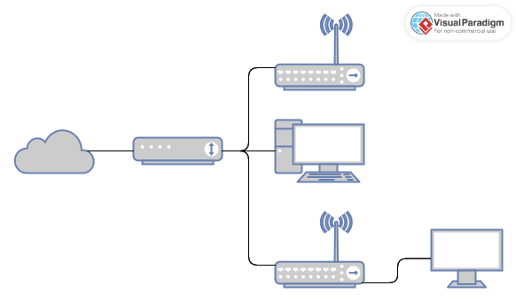

+++
title = "EX-R 桥接 IPTV"
slug = "bridge-iptv-on-ex-r"
date = 2024-04-21T10:01:11+08:00
lastmod = 2024-04-29T13:56:00+08:00
publishDate = 2024-04-21T10:01:11+08:00
+++

突然发现 Blog 已经荒废了很久，平淡无奇的生活实在是没什么好写的。

之前直接通过修改光猫中配置，将 Internet 口桥接至路由器，IPTV 还是直接插在光猫上。  
虽然这样 A 面无法通过认证，但是除了开机会等待一阵子，其他功能并未受到影响。

就这样一直稳定的使用了几年。可最近突然 IPTV 机顶盒无法正确获取时间了，随之而来的是回放功能也彻底报废。

参考了一些教程之后，感觉在 EX-R 上还是有操作可信性的。

## 当前拓扑

网络结构没有其他分享的教程中那么复杂，光猫后只有 IPTV 机顶盒，WI-FI 等设备，没有下卦其他交换机。



## 开始干

1. 先修改光猫中设置，将 Internet 口中，某端口但绑定取消。  
   这样就可以实现任意端口均可以进行 PPPoE 的拨号。

1. 用一根跳线，将光猫的3～4口 (IPTV 口) 连接至 EX-R 的 Eth0 口   
   这时如果已经通过 Wizards 中 Basic Setup 设置后，可以正常进行 PPPoE 拨号，其他下卦设备可以正常访问互联网。

1. IPTV 机顶盒插入 Eth2 口，随后添加 VLAN 与 Bridge
   ``` bash
   set interfaces bridge br85
   set interfaces ethernet eth0 vif 85 bridge-group bridge br85
   set interfaces switch switch0 vif 85 bridge-group bridge br85
   ```
1. 设置 DNS 选项
   ``` bash
   set service dhcp-server global-parameters "option option-55 code 55 = array of unsigned integer 16;"
   set service dhcp-server global-parameters "option option-60 code 60 = string;"
   set service dhcp-server global-parameters "option option-125 code 125 = string;"

   set service dhcp-server shared-network-name LAN subnet 192.168.1.0/24 subnet-parameters "option option-55 3,6,58,59,60,125;"
   set service dhcp-server shared-network-name LAN subnet 192.168.1.0/24 subnet-parameters "option option-60 00:00:01:00:02:03:43:50:45:03:0e:45:38:20:47:50:4f:4e:20:52:4f:55:54:45:52:04:03:31:2e:30;"
   set service dhcp-server shared-network-name LAN subnet 192.168.1.0/24 subnet-parameters "option option-125 00:00:00:00:1b:02:06:48:47:57:2d:43:54:03:05:48:47:32:32:31:0a:02:20:00:0b:02:00:55:0d:02:00:2e;"
   ```

   大概解释
   - OPTION-55 的类型是 uint16 数组，值为 会返回的 DHCP OPTION 项；
   - OPTION-60, OPTION-125 的类型是 string , 伪造光猫的Vendor信息；

   此处不能照抄OpenWRT的配置，重点在于体会精神。因为 EX-R 默认的DHCP服务器是 ISC DHCP ，而 OpenWRT 为 dnsmasq 。

1. 开启 VLAN Aware  
   
    ``` bash
    set interfaces switch switch0 switch-port vlan-aware enable
    set interfaces switch switch0 switch-port interface eth2 vlan vid 85
    ```

如果一切正常，这时候 IPTV 可以正常通过 A/B 面认证，其他设备的互联网也可以正常使用了。


## 其他

在开启 HW Offload 之后，下挂10个设备+IPTV 时，CPU 负载基本低于 10% 。

如果不开启 VLAN Aware ，IPTV 开机后，从局端下发的视频数据流会广播至整个局域网内。  
虽然不会对 IPTV 本身有影响，但增加了所有设备的负载。 (RX最多增加约 10 Mbps 左右)


## 参考链接:
1. [中兴光猫F450G v1.0配置 by 蜃雨腥风](https://web.archive.org/web/20240302085748/https://hi.pgx.me/2018/03/zte-f450g-config.html)
1. [「IPTV」上海电信改桥接 IPTV设置小白教程（软路由/交换机VLAN设置）更新中](https://aray.cn/archives/14234)
